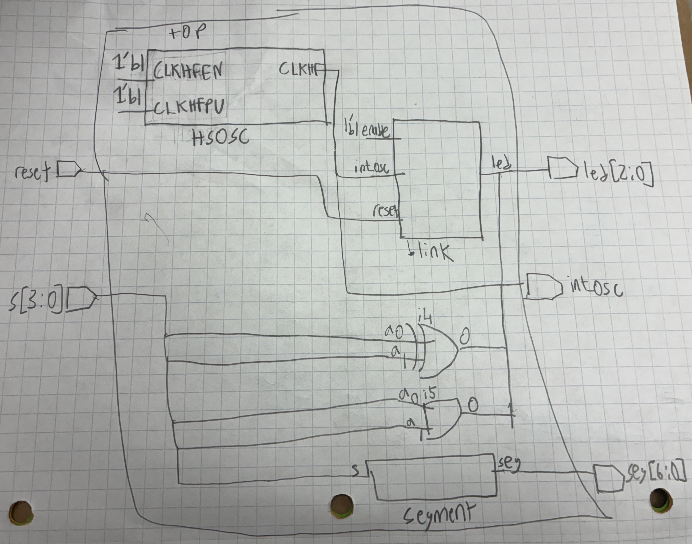
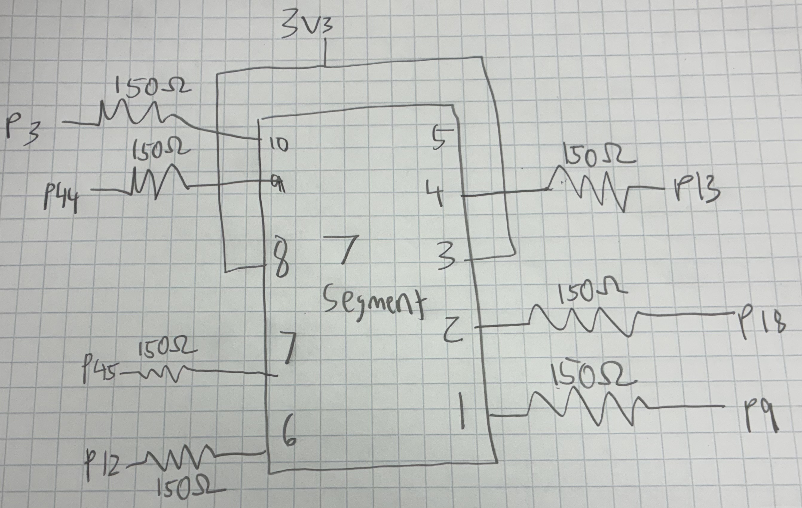
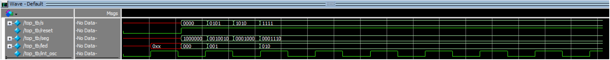
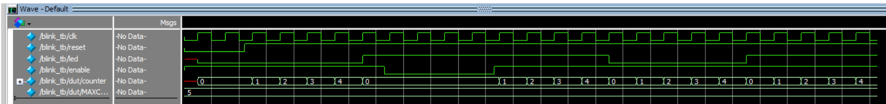
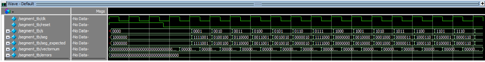

# Introduction

In this lab, a design was implemented on the FPGA to to turn 2 LEDs on and off based on 4 switch inputs, as well as to display on a 7 segment display 16 hexadecimal values based on the switch inputs. A LED was also blinked at 2.4Hz using the on board high speed oscillator. The oscillator was configured at a frequency of 48MHz, and a counter was used to divide the frequency down to 2.4Hz.

# Design and Testing Methodology

The design was implemented using SystemVerilog that was sythesized and implemented on the FPGA. Testbenches were utilized to simulate the design and verify that it was functioning correctly. The design was then implemented on the FPGA and tested using the switches, LEDs, and 7 segment display.

The 7 segment display uses a decoder module which maps the 4 switch inputs to the corresponding segments of the display to show hexadecimal values from 0 to F. The LEDs are controlled by the switch inputs, where specific combinations of switch states will turn the LEDs on or off.

The blinking LED was implemented using a counter that counts the clock cycles of the 48MHz oscillator. When the counter reaches a certain value, it toggles the state of the LED, resulting in a blinking effect at 2.4Hz. Since the LED has to turn on and off, the counter was set to count to 10 million. 48MHz / (2.4Hz*2) = 10 million.

The 2 LEDs on the board were controlled by the 4 switches, where specific combinations of switch states will turn the LEDs on or off.

The 7 segment display was wired to the FPGA using a breadboard, and current limiting resistors were connected in series with the segments to prevent excess current.

Testbenches were created to simulate the behavior of the design before implementing it on the FPGA.

# Technical Documentation

GitHub Repository: [e155-lab1 GitHub Repository](https://github.com/TheRealAniG/e155-lab1/tree/main)

## Block Diagram

The block diagram in Figure 1 shows the the design of the system. The top level contains the internal oscillator module, the blinker/counter module, and the segment decoder module. The inputs are the switches and reset, and it toggles the 7-segment and LEDs as output. It also outputs the oscillator for easy viewing.

## Schematic

The schematic in Figure 2 shows the wiring of the 7 segment display to the FPGA. The segments are connected to the FPGA pins through current limiting resistors to prevent excess current from flowing through the segments. The forward voltage of the segments is 2.0V, and the voltage supplied is 3.3V. The voltage across the resistor is 1.3V, and the goal was 5-20 mA. A resistor value of 150 ohms was chosen to achieve a current of 8.67 mA (1.3V/150Ω), which is within the desired range.

# Results and Documentation

The design performed as expected. The LEDs lit up correctly based on the switch inputs, and the 7 segment display showed the correct hexadecimal values. The blinking LED also blinked at the expected frequency of 2.4Hz.

::: {.callout-note collapse="true"}

## Top Module Testbench Waveform

:::

::: {.callout-note collapse="true"}

## Top Module Testbench Log
These tests verify top module functionality, and ensure connection to submodules.

PASSED! The top module behaves as desired at time: 32000.

PASSED! The top module behaves as desired at time: 42000.

PASSED! The top module behaves as desired at time: 52000.

PASSED! The top module behaves as desired at time: 62000.

PASSED! The top module behaves as desired at time: 72000.

PASSED! The top module behaves as desired at time: 82000.
:::

::: {.callout-note collapse="true"}

## Blinker Module Testbench Waveform

:::

::: {.callout-note collapse="true"}

## Segment Module Testbench Waveform

:::

# Conclusion

Lab 1 was sucessfull. The simulations and physical hardware worked as intended. Combinational logic was used to control the LEDs and a decoder was used to control the 7 segment display. A counter was used to blink an LED at a frequency of 2.4Hz. I spent around 25-30 hours on this lab.

# Ai Prototype Summary

::: {.callout-note collapse="true"}

## Ai Code

// Blink LED at 2 Hz using the Lattice UP5K internal oscillator

module top (
    input  logic reset_n,
    output logic led
);

    logic clk;
    logic [23:0] counter;

    // Internal high-speed oscillator
    // CLKHF_DIV = 2'b00 gives 48 MHz
    HSOSC #(
        .CLKHF_DIV(2'b00)
    ) hf_osc (
        .CLKHFPU(1'b1),
        .CLKHFEN(1'b1),
        .CLKHF(clk)
    );

    // 48 MHz / (2 * 2 Hz) = 12,000,000 clocks per toggle
    localparam int MAXCOUNT = 12_000_000;

    always_ff @(posedge clk) begin
        if (!reset_n) begin
            counter <= 0;
            led     <= 0;
        end
        else if (counter == MAXCOUNT - 1) begin
            counter <= 0;
            led     <= ~led;
        end
        else begin
            counter <= counter + 1;
        end
    end

endmodule

:::

I used ChatGPT Plus for this task.

Ai gave me an output relatively similar to my own code, except it is all in one module which makes sense since that is what its prompt was. The code also blinks the LED at 2Hz instead of 2.4Hz, which is a small difference. It didn't use anything I hadn't seen before and the output synthesized on the first attempt. I would say that Ai was very successful in this case and I would not change what it did. 

I would say in this case the code that Ai wrote was clean and accurate and better than what I would have written. In this case Ai was very helpful and I would use it for this in the future with similar prompting. 