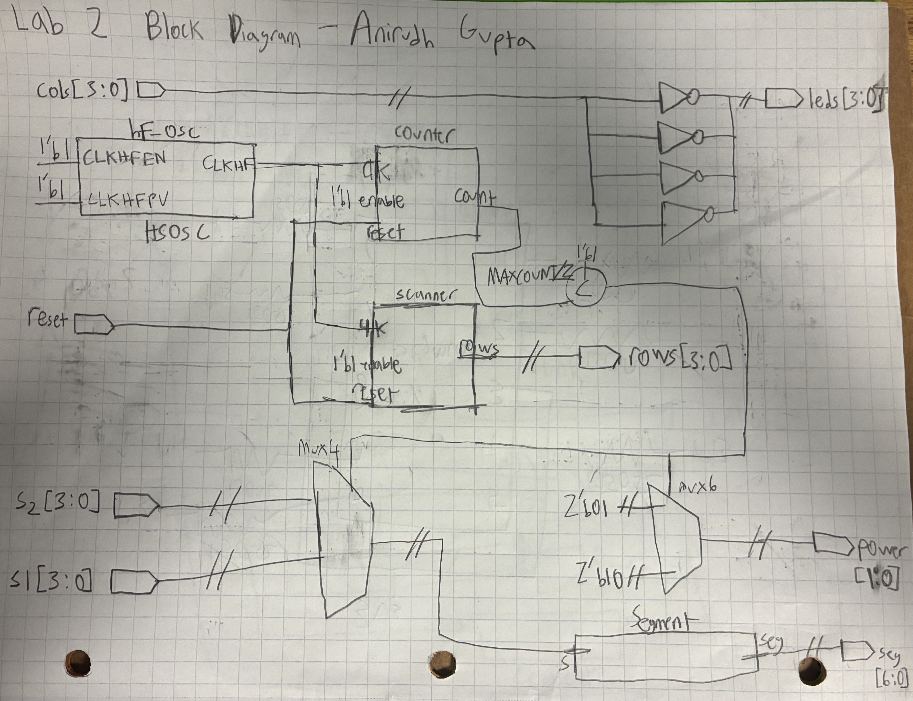
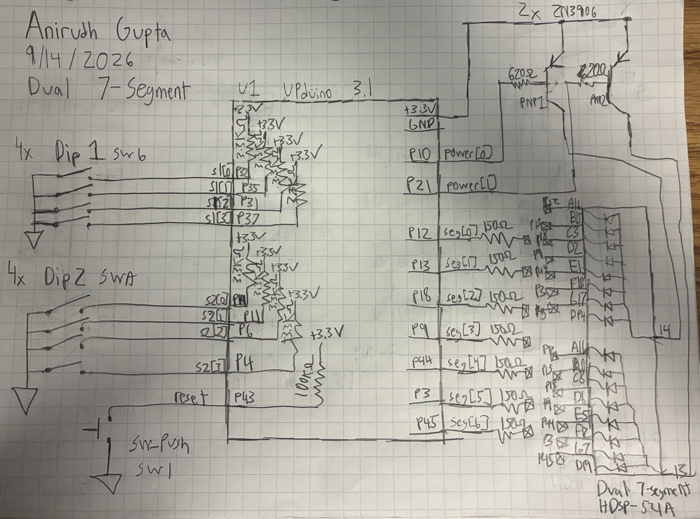
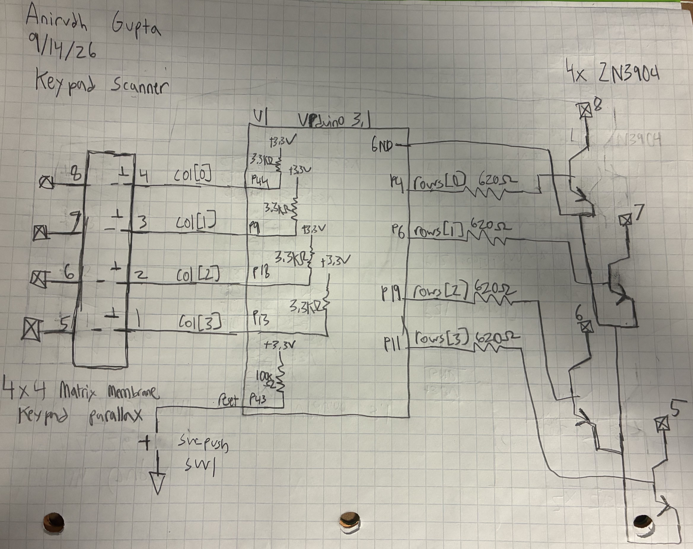
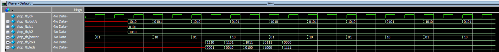
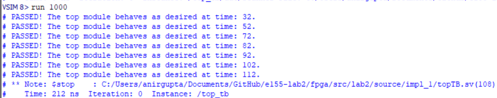
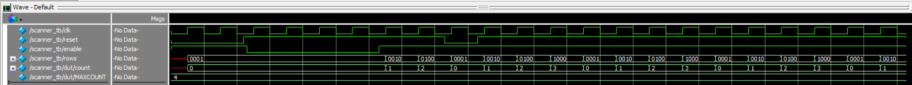
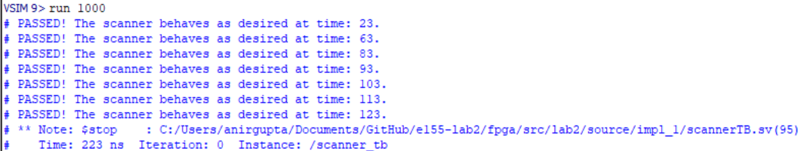

# Introduction

In this lab, a design was implemented on the FPGA to display two independent hexadecimal numbers on a dual-segment display using two, four input DIP switches. Both digits were driven by a time multiplexed decoder module. Additionally, a scanning circuit was implemented to rotate outputs between 1000, 0100, 0010, and 0001 at a rate of 2Hz. These outputs were attatched to the rows of a keypad, and the inputs were attatched to the columns of the keypad. The result is that when a row is toggled and a column is pressed, a corresponding on-board LED will light up. 

# Design and Testing Methodology

The design was implemented using SystemVerilog that was sythesized and implemented on the FPGA. Testbenches were utilized to simulate the design and verify that it was functioning correctly. The design was then implemented on the FPGA and tested.

The dual segment display uses the same 7-segment decoder module from lab 1. However, additional inputs were added to control the second digit (4 input DIP switch with pullup resistors). The power and decoder module is time multiplexed to alternate at 96Hz. To the user the the display appears to show both digits simultaneiously. For half the time, the first digit uses the first 4 input DIP switch, and for the other half of the time, the second digit uses the second 4 input DIP switch. This is the same for how power is applied as it alternates between the two digits. The power is controlled by PNP transistors that are toggled to allow current to flow through the 2 displays.

The keypad scanner uses a scanning module that rotates the outputs at 2Hz. The outputs are connected to the rows of the keypad, and alternate between 1000, 0100, 0010, and 0001.

In the top module, the columns of the keypad are connected to the inputs of the FPGA. When a column is pressed, and LED is lit up on board. However, the LED blinks because in order for the FPGA to register an input the column must read a 0, which means the column must be pressed at the same time that the row is toggled. This means that the LED will only light up for a fraction of a second, and then turn off again. 

The keypad scanner uses NPN transistors that are connected to the row outputs. Additionally, the columns are `connected to the inputs of the FPGA through pullup resistors. The NPN transistors are used to sink current from the rows of the keypad, and the pullup resistors are used to ensure that the columns read a high value when not pressed. 

# Technical Documentation

GitHub Repository: [e155-lab2 GitHub Repository](https://github.com/TheRealAniG/e155-lab2)

## Block Diagram

The block diagram in Figure 1 shows the the design of the system. The top level contains the internal oscillator module, the counter module, the segment decoder module, and the keypad scanner module. It also contains combinational logic to control the 2 digit display and the keypad scanner. The top module controls both the dual segment functionality and the keypad scanner functionality.

## Schematics

The schematic in Figure 2 shows the wiring for the dual segment circuitry. This includes the two 4 input DIP switches, and the reset signal. Using these inputs the fpga controls the two 7 segments displays by sending the appropriate signals to the segments and controlling the power to each display. Pullup resistors are used on the DIP switches.

The schematic in Figure 3 shows the wiring for the keypad scanner. This includes the column inputs and the row outputs to control the NPN transistors. Pullup resistors are used on the column inputs. 

## Calculations

The FPGA pins have a maximum current rating of 8mA IOL and -8mA IOH. This means that the maximum current that can be sourced or sunk by a pin is 8mA. Additionally, the pins supply 3.3V. The base-emitter saturation voltage of both the NPN and PNP transistors is around 0.7V which is used as the forward voltage. A resistor value of 620 Ohms was chosen to limit the current below the 8mA threshold. 

$$
I = \frac{3.3V - 0.7V}{620\ \Omega} = 4.19\text{ mA}
$$

# Results and Documentation

The design performed as expected. Both segments displayed the correct hexadecimal values based on the switch inputs simultaneously and at equal brightness. The keypad scanner also functioned as expected, as the on board LEDs lit up when the corresponding row was toggled and column was pressed. The LEDs blinked as expected, and their behavior changed depending on which buttons were presses as expected.

::: {.callout-note collapse="true"}

## Top Module Testbench Waveform

:::

::: {.callout-note collapse="true"}

## Top Module Testbench Messages

:::

::: {.callout-note collapse="true"}

## Scanner Module Testbench Waveform

:::

::: {.callout-note collapse="true"}

## Scanner Module Testbench Messages

:::

# Conclusion

Lab 2 was sucessfull. The simulations and physical hardware worked as intended. I was able to successfully add multiplexing functionality to adapt lab 1 code to control two 7 segment displays. Additionally, was able to implement a keypad scanner that rotated through the rows of the keypad and lit up the corresponding on board LED when a column was pressed. I spent around 24 hours on this lab. 

# Ai Prototype Summary

::: {.callout-note collapse="true"}

## Ai Code Part 1

module mux_7seg (
    input  logic       clk,
    input  logic [3:0] s1,
    input  logic [3:0] s2,
    output logic [6:0] seg1,
    output logic [6:0] seg2
);

    logic       select;
    logic [3:0] decoder_in;
    logic [6:0] decoder_out;

    // Alternate between s1 and s2
    always_ff @(posedge clk) begin
        select <= ~select;
    end

    // Select which 4-bit input goes into the decoder
    always_comb begin
        if (select == 1'b0)
            decoder_in = s1;
        else
            decoder_in = s2;
    end

    // Single 4-bit to 7-segment decoder
    always_comb begin
        case (decoder_in)
            4'h0: decoder_out = 7'b1000000;
            4'h1: decoder_out = 7'b1111001;
            4'h2: decoder_out = 7'b0100100;
            4'h3: decoder_out = 7'b0110000;
            4'h4: decoder_out = 7'b0011001;
            4'h5: decoder_out = 7'b0010010;
            4'h6: decoder_out = 7'b0000010;
            4'h7: decoder_out = 7'b1111000;
            4'h8: decoder_out = 7'b0000000;
            4'h9: decoder_out = 7'b0010000;
            4'hA: decoder_out = 7'b0001000;
            4'hB: decoder_out = 7'b0000011;
            4'hC: decoder_out = 7'b1000110;
            4'hD: decoder_out = 7'b0100001;
            4'hE: decoder_out = 7'b0000110;
            4'hF: decoder_out = 7'b0001110;
            default: decoder_out = 7'b1111111;
        endcase
    end

    // Route the decoder output to the correct 7-segment output
    always_comb begin
        // Common-anode display: 1 = off
        seg1 = 7'b1111111;
        seg2 = 7'b1111111;

        if (select == 1'b0)
            seg1 = decoder_out;
        else
            seg2 = decoder_out;
    end

endmodule

:::

::: {.callout-note collapse="true"}

## Ai Code Part 2

// Anirudh Gupta
// Time multiplex one seven-segment decoder between two 4-bit inputs

module top (
    input  logic [3:0] s1,
    input  logic [3:0] s2,
    input  logic       reset,
    output logic [6:0] seg1,
    output logic [6:0] seg2
);

    logic       int_osc;
    logic [15:0] count;
    logic       select;

    logic [3:0] mux_input;
    logic [6:0] decoder_output;

    // Internal 48 MHz oscillator
    HSOSC #(.CLKHF_DIV(2'b00))
        hf_osc (
            .CLKHFPU(1'b1),
            .CLKHFEN(1'b1),
            .CLKHF(int_osc)
        );

    // Counter used to slow down multiplexing
    always_ff @(posedge int_osc) begin
        if (reset == 0)
            count <= 0;
        else
            count <= count + 1;
    end

    // Use one bit of counter as mux select
    assign select = count[15];

    // Select which 4-bit input goes into decoder
    assign mux_input = select ? s2 : s1;

    // SINGLE seven-segment decoder
    segment decoder (
        .s   (mux_input),
        .seg (decoder_output)
    );

    // Route decoder output to the appropriate output
    always_comb begin
        seg1 = 7'b1111111;   // common-anode display OFF
        seg2 = 7'b1111111;

        if (select == 0)
            seg1 = decoder_output;
        else
            seg2 = decoder_output;
    end

endmodule

// ----------------------------------------------------
// Common-anode seven-segment decoder
// 0 = segment ON
// 1 = segment OFF
// ----------------------------------------------------

module segment (
    input  logic [3:0] s,
    output logic [6:0] seg
);

    always_comb begin
        case (s)
            4'b0000: seg = 7'b1000000; // 0
            4'b0001: seg = 7'b1111001; // 1
            4'b0010: seg = 7'b0100100; // 2
            4'b0011: seg = 7'b0110000; // 3
            4'b0100: seg = 7'b0011001; // 4
            4'b0101: seg = 7'b0010010; // 5
            4'b0110: seg = 7'b0000010; // 6
            4'b0111: seg = 7'b1111000; // 7
            4'b1000: seg = 7'b0000000; // 8
            4'b1001: seg = 7'b0010000; // 9
            4'b1010: seg = 7'b0001000; // A
            4'b1011: seg = 7'b0000011; // b
            4'b1100: seg = 7'b1000110; // C
            4'b1101: seg = 7'b0100001; // d
            4'b1110: seg = 7'b0000110; // E
            4'b1111: seg = 7'b0001110; // F
            default: seg = 7'b1111111;
        endcase
    end

endmodule

:::

I used ChatGPT Plus for this task.

Ai was prompted to create the time multiplexed dual seven segment display functionality. I did this two ways: the first way was without giving it any of my previous code, and the second was was by giving it my lab 1 code. In both cases, the code that Ai outputed synthesized first try without having to reprompt it. 

The code that Ai created without any prior context was actually shorter and more efficient, however it was harder to read and lacked comments. In both cases the output that Ai gave was impressive and exceded my expectations. I would say that Ai was very successful in this case and I would not change what it did.