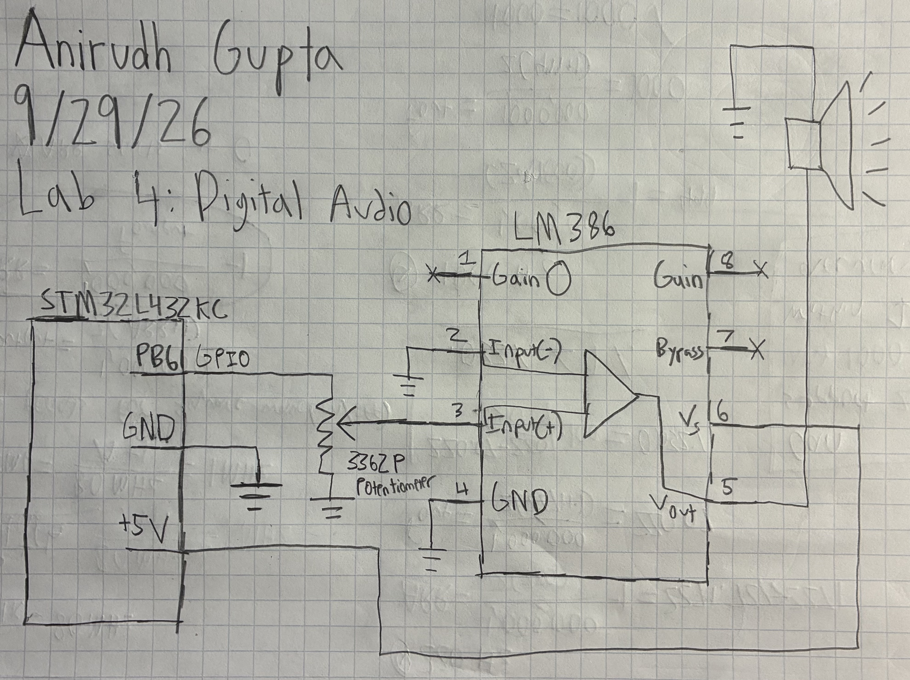
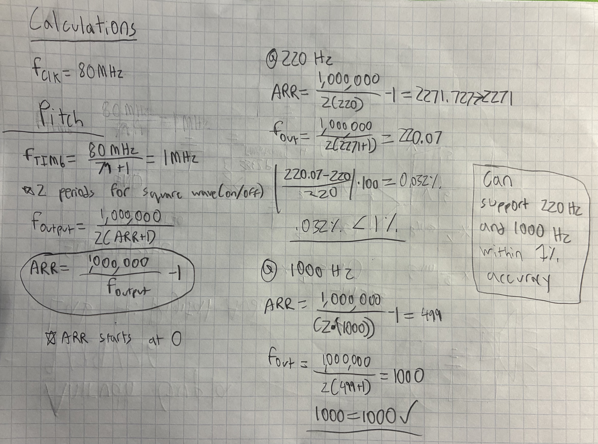
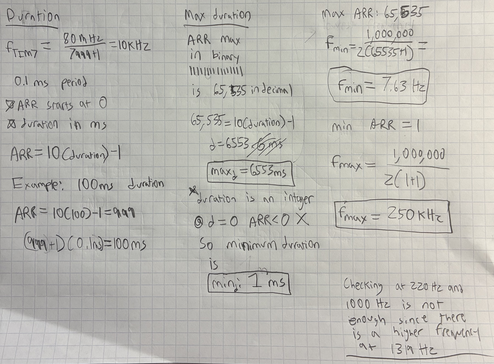

# Introduction

In this lab, a design was implemented on the MCU to drive a speaker using square waves. I implemented timer functionality on the MCU to drive the speaker using pairs of frequency and duration information. The final design plays Fur Elise and a custom tune. 

# Design and Testing Methodology

The design was implemented using C code on an STMicro MCU. The design enables a GPIO pin to output a square wave of varying frequencies and durations to drive the speaker. The output of the pin goes into a potentiometer to adjust the volume. The output of the potentiometer goes into an LM386 audio amplifier which then drives the speaker. 

This design built off of the clock configuration starter code. The code had completed FLASH and GPIO functionality, but the RCC had to completed to create a 80 Mhz clock. I also had to implement the timer functionality to generate the square waves of varying frequencies and durations. The code was created using .h files to configure the hardware and .c files to implement the functionality. The main.c file is what puts everything together to play the songs. The timers I chose to implement were the most basic timers on the MCU (TIM6 and TIM7).

In order to test the design, I first tested the output of the GPIO pin to ensure it was generating the correct square waves. Once I ensured that was correct, I built the rest of the speaker circuit in order to drive the speaker and play the songs.

# Technical Documentation

GitHub Repository: [e155-lab4 GitHub Repository](https://github.com/TheRealAniG/e155-lab4/tree/dev)

## Schematic

The schematic in Figure 1 shows the full circuit design for the lab. The GPIO pin outputs into the potentiometer to adjust the volume. The output of the potentiometer goes into an LM386 audio amplifier which then drives the speaker.

## Calculations

Calculations Spreadsheet: [Google Sheets](https://docs.google.com/spreadsheets/d/1y0T6E2hisK-LrxJCk4ecTsmUzGSWyLcUjOgePXpkAKg/edit?usp=sharing)

Figures 2 and 3 show documentation and calculations demonstrating how durations and pitches are derived from the timer configurations. Calculations demonstrate that the system can create 220 Hz and 1000 Hz pitches within 1% accuracy.

Calculations for minimum duration, maximum duration, minimum frequency, and maximum frequency are also shown in Figures 2 and 3.

The spreadsheet shows that all notes in Fur Elise can be played within 1 % accuracy. All the notes are within error bounds, however checking at 220 Hz and 1000 Hz is not sufficient because the song has a note with a frequency of 1319 Hz, which is outside of the range.

# Results and Documentation

The design performed exactly as expected. It was able to play Fur Elise with the correct timing and pitch. All the rests played properly, and the circuity matched expectations. I was able to use a potentiometer to adjust the volume of the speaker. I was also able to add another compositions and verify that it worked on the hardware.

# Conclusion

Lab 4 was successful, everything worked as intended. I was able to successfully program the MCU using C code and drive the speaker. I spent around 15 hours on this lab. 

# AI Prototype Summary

I used ChatGPT Plus for this task.

ChatGPT gave me a good response. In my code I used the most basic timers, TIM6 and TIM7. I used these timers because I felt like they would be the most simple to implement and they would simplify the code the most while still meeting the specs.

ChatGPT recommended I could use TIM15 and TIM16. These timers are more complicated but offer more functionality. They can work as a timer, but also directy control GPIO PWM generation. This is a better design because it allows for output to be controlled by hardware rather than doing it internally by software.

Overall, the approach that ChatGPT gave me was probably the better solution, but it would have been potentially more complicated to implement.