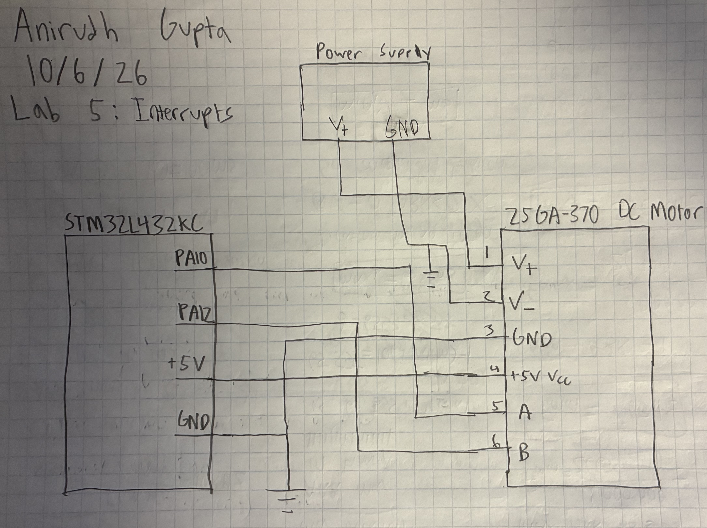
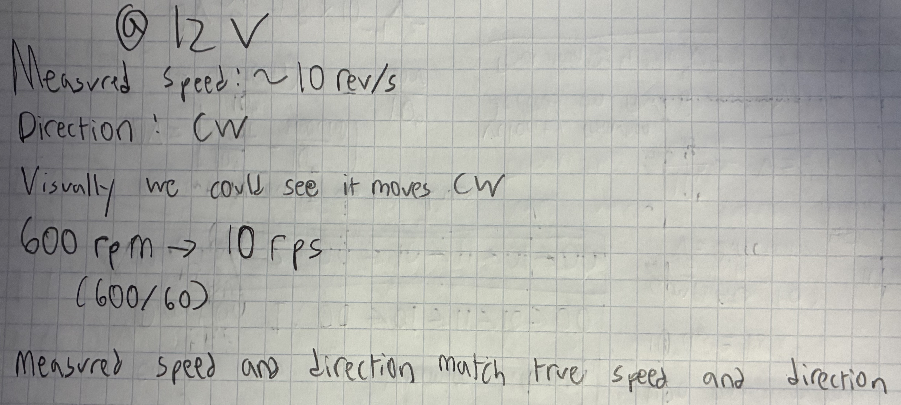
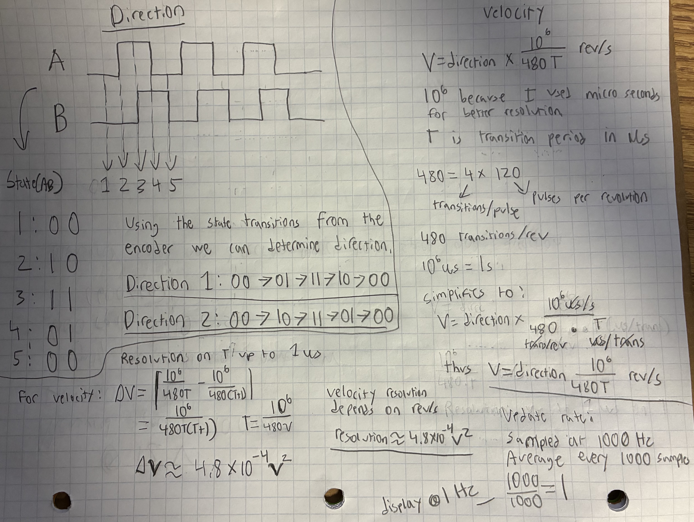
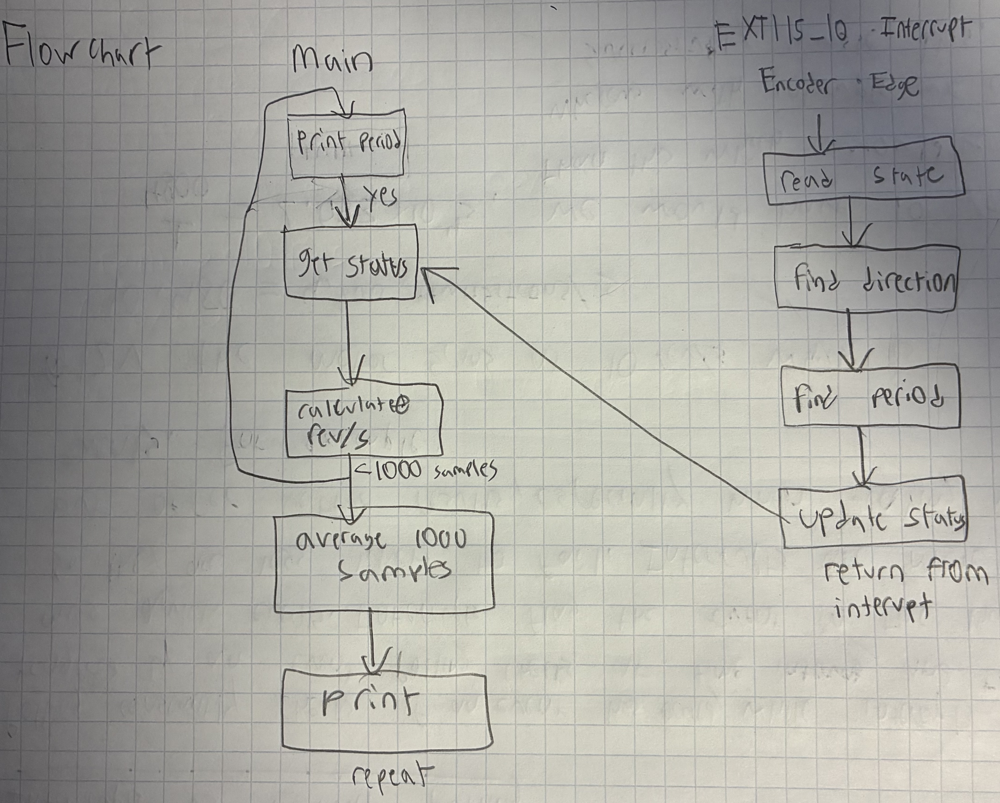
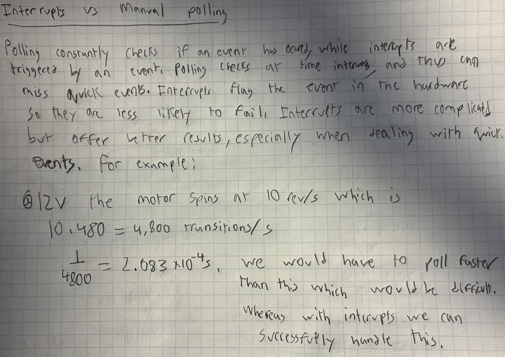

# Introduction

In this lab I used an MCU to determine the angular velocity of a brushed DC motor by reading from a quadrature encoder using interrupts. Design was implemented using C code on the STM32 MCU.

# Design and Testing Methodology

In this lab I used the libraries from the interrupts tutorial as starter code, and I used the source files as guidance for my implementation. I used one interrupt handler to read both encoder signal channels. Using these interrupts I was able to read the pulses from the motors.

In order to find direction, I used the phase relationship between the two encoder signals. By mapping the transitions of these signals, I could determine the rotation direction of the motor. In order to find velocity I used the period between transitions. Every pulse corresponded to 4 transitions so I had to account for this when calculating the velocity.

In order to improve accuracy, I sampled every 1 ms, and averaged every 1000 samples. Thus, I outputed direction and velocity at a rate of 1 Hz.

I tested the design at low and high speeds as well as when it wasn't moving. The external circuitry for this lab was very simple, and consisted only of hooking up the motor.

# Technical Documentation

GitHub Repository: [e155-lab5 GitHub Repository](https://github.com/TheRealAniG/e155-lab5/tree/main)

## Schematic

The schematic in Figure 1 shows the full circuit design for the lab. The motor is powered by an external power supply that can vary voltage in order to change motor speed. 

## Calculations and Flowchart

Figure 2 shows that the measured speed and direction match the observed motor speed and direction

Figure 3 shows how raw encoder pulses and their timing are converted into a velocity in rev/s and a direction. It also includes calculations to back up the update rate and resolution of velocity achieved.

Figure 4 shows a flowchart illustrating the main loop and the interrupt handler, and how they communicate. Essentially, the main loop utilizes the encoder state values which is updated by the interrupt handler.

Figure 5 compares the performance of interrupt-based code to manual polling at high speeds, and quantitatively explains why there may be issues with polling at high speeds.

# Results and Documentation

The design performed exactly as expected. It was able to accurately measure the motor's speed and direction under various conditions. It worked at low and high speeds, and also when the motor wasn't moving. The results matched calculated values. The output velocity did not fluctuate significantly.

# Conclusion

Lab 5 was successful, everything worked as intended. I was able to successfully program the MCU using C code and measure motor speed and direction using encoder pulses and interrupts. I spent around 21 hours on this lab. 

# AI Prototype Summary

::: {.callout-note collapse="true"}

## Ai Code

#include "stm32l432xx.h"
#include <stdint.h>

// ============================================================
// Encoder data
// ============================================================

typedef struct {
    uint32_t edge_interval_us;
    uint32_t idle_time_us;
    int8_t rotation;
} RotaryData;

// Visible in debugger
volatile RotaryData rotary;

// Internal state
static volatile uint8_t old_ab = 0;
static volatile uint32_t previous_edge_time = 0;
static volatile uint32_t measured_interval = 0;
static volatile int8_t measured_direction = 0;
static volatile uint8_t first_edge_received = 0;

// ============================================================
// Quadrature transition table
//
// Previous AB and new AB are combined into a 4-bit index.
//
// +1 = one direction
// -1 = opposite direction
//  0 = invalid transition / no movement
// ============================================================

static const int8_t decode_table[16] = {
     0, -1,  1,  0,
     1,  0,  0, -1,
    -1,  0,  0,  1,
     0,  1, -1,  0
};

// ============================================================
// Read encoder pins
// ============================================================

static uint8_t readAB(void)
{
    uint8_t channel_a = (GPIOA->IDR >> 0) & 1U;
    uint8_t channel_b = (GPIOA->IDR >> 1) & 1U;

    return (channel_a << 1) | channel_b;
}

// ============================================================
// Determine actual TIM2 clock
// ============================================================

static uint32_t tim2InputClock(void)
{
    SystemCoreClockUpdate();

    uint32_t apb1_setting =
        (RCC->CFGR & RCC_CFGR_PPRE1_Msk)
        >> RCC_CFGR_PPRE1_Pos;

    // APB1 divider = 1
    if (apb1_setting < 4U) {
        return SystemCoreClock;
    }

    // Encodings:
    // 100 -> /2
    // 101 -> /4
    // 110 -> /8
    // 111 -> /16

    uint32_t apb_div =
        1U << (apb1_setting - 3U);

    uint32_t pclk1 =
        SystemCoreClock / apb_div;

    // STM32 timers receive 2x PCLK when APB prescaler > 1
    return 2U * pclk1;
}

// ============================================================
// Configure TIM2 as free-running 1 us timer
// ============================================================

static void setupTimebase(void)
{
    // Turn on TIM2 clock
    RCC->APB1ENR1 |= RCC_APB1ENR1_TIM2EN;

    // Stop timer while configuring
    TIM2->CR1 = 0;

    uint32_t timer_frequency = tim2InputClock();

    // Divide timer clock down to 1 MHz
    //
    // 1 MHz = one count every 1 microsecond
    TIM2->PSC =
        (timer_frequency / 1000000U) - 1U;

    // TIM2 is 32 bit
    TIM2->ARR = 0xFFFFFFFFU;

    // Load prescaler immediately
    TIM2->EGR = TIM_EGR_UG;

    // Start from zero
    TIM2->CNT = 0;

    // Clear timer flags
    TIM2->SR = 0;

    // Start timer
    TIM2->CR1 |= TIM_CR1_CEN;
}

// ============================================================
// Process one encoder edge
// ============================================================

static void processEncoderEdge(void)
{
    uint8_t new_ab = readAB();

    uint8_t table_index =
        (old_ab << 2) | new_ab;

    int8_t step =
        decode_table[table_index];

    if (step != 0) {

        uint32_t timestamp = TIM2->CNT;

        measured_direction = step;

        if (first_edge_received) {

            // Unsigned subtraction also handles timer rollover
            measured_interval =
                timestamp - previous_edge_time;
        }

        else {

            first_edge_received = 1U;
            measured_interval = 0;
        }

        previous_edge_time = timestamp;
    }

    old_ab = new_ab;
}

// ============================================================
// Configure PA0 and PA1 as encoder inputs with EXTI
// ============================================================

static void setupEncoderPins(void)
{
    // GPIOA clock
    RCC->AHB2ENR |= RCC_AHB2ENR_GPIOAEN;

    // SYSCFG clock
    RCC->APB2ENR |= RCC_APB2ENR_SYSCFGEN;

    // --------------------------------------------------------
    // PA0 and PA1 input mode
    // MODER = 00
    // --------------------------------------------------------

    GPIOA->MODER &=
        ~((3U << 0) |
          (3U << 2));

    // --------------------------------------------------------
    // Internal pull-ups
    // PUPDR = 01
    //
    // Useful for common mechanical/open-collector encoders.
    // --------------------------------------------------------

    GPIOA->PUPDR &=
        ~((3U << 0) |
          (3U << 2));

    GPIOA->PUPDR |=
        ((1U << 0) |
         (1U << 2));

    // --------------------------------------------------------
    // Route:
    //
    // PA0 -> EXTI0
    // PA1 -> EXTI1
    //
    // GPIOA corresponds to 0000.
    // --------------------------------------------------------

    SYSCFG->EXTICR[0] &=
        ~((0xFU << 0) |
          (0xFU << 4));

    // --------------------------------------------------------
    // Interrupt on both rising and falling edges
    // --------------------------------------------------------

    EXTI->RTSR1 |=
        (1U << 0) |
        (1U << 1);

    EXTI->FTSR1 |=
        (1U << 0) |
        (1U << 1);

    // Clear old pending interrupt flags
    EXTI->PR1 =
        (1U << 0) |
        (1U << 1);

    // Unmask EXTI0 and EXTI1
    EXTI->IMR1 |=
        (1U << 0) |
        (1U << 1);

    // Save starting quadrature state
    old_ab = readAB();

    // NVIC setup
    NVIC_ClearPendingIRQ(EXTI0_IRQn);
    NVIC_ClearPendingIRQ(EXTI1_IRQn);

    NVIC_SetPriority(EXTI0_IRQn, 1);
    NVIC_SetPriority(EXTI1_IRQn, 1);

    NVIC_EnableIRQ(EXTI0_IRQn);
    NVIC_EnableIRQ(EXTI1_IRQn);
}

// ============================================================
// Read current encoder information
// ============================================================

static RotaryData sampleRotary(void)
{
    RotaryData result;

    uint32_t interrupt_state = __get_PRIMASK();

    __disable_irq();

    result.edge_interval_us =
        measured_interval;

    result.rotation =
        measured_direction;

    if (first_edge_received) {

        result.idle_time_us =
            TIM2->CNT - previous_edge_time;
    }

    else {

        result.idle_time_us = 0;
    }

    if (interrupt_state == 0U) {
        __enable_irq();
    }

    return result;
}

// ============================================================
// PA0 / EXTI0 interrupt
// ============================================================

void EXTI0_IRQHandler(void)
{
    if (EXTI->PR1 & (1U << 0)) {

        // Write 1 to clear pending interrupt
        EXTI->PR1 = (1U << 0);

        processEncoderEdge();
    }
}

// ============================================================
// PA1 / EXTI1 interrupt
// ============================================================

void EXTI1_IRQHandler(void)
{
    if (EXTI->PR1 & (1U << 1)) {

        // Write 1 to clear pending interrupt
        EXTI->PR1 = (1U << 1);

        processEncoderEdge();
    }
}

// ============================================================
// Main
// ============================================================

int main(void)
{
    setupTimebase();

    setupEncoderPins();

    while (1) {

        rotary = sampleRotary();

        // Put a breakpoint here if desired.
        __NOP();
    }
}
:::

I used ChatGPT Plus for this AI task.

The code built successfully on the second try. I had to tell the AI assistant to make sure I could paste everything into one main.c file to run it. This allowed me to test the code in a single file environment.

The code seems to use some kind of states as well, except it does so using a matrix. It also writes the code a lot more efficiently and has two interrupt handlers instead of just one. While the code is more efficient, it is harder to read and and understand.